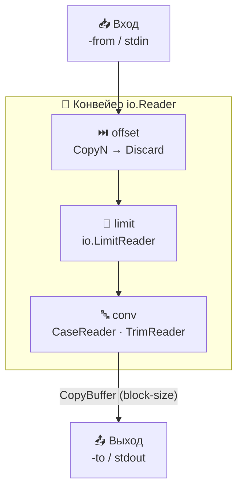

<div align="center">

# 📄 Copying Files Utility

### Утилита для копирования файлов

**Читай. Преобразуй. Копируй.**

CLI-утилита на **Go** — минималистичный аналог unix-команды **`dd`**. Читает данные из файла
или `stdin`, применяет набор преобразований и пишет результат в новый файл или `stdout`.
Работа с источниками и приёмниками построена целиком на интерфейсах пакета **`io`**.

<br/>

<!-- Технологии -->


<!-- Мета-бейджи репозитория -->
<br/>


</div>

---

## ✨ Возможности

- 📥 **Гибкий вход** — источник данных задаётся через `-from`, а если он не указан — читается `stdin`.
- 📤 **Гибкий выход** — приёмник задаётся через `-to`, по умолчанию результат печатается в `stdout`.
- ⏭️ **Смещение (`-offset`)** — пропуск заданного количества байт от начала входа.
- 📏 **Лимит (`-limit`)** — максимальное число читаемых байт (по умолчанию — до `EOF`).
- 🧱 **Блочное чтение/запись (`-block-size`)** — размер одного блока при копировании.
- 🔤 **Преобразования (`-conv`)** — приведение к верхнему/нижнему регистру и обрезание пробелов.
- 🌍 **UTF-8** — корректная обработка многобайтовых символов при преобразованиях.
- 🛡️ **Безопасность** — существующие файлы не перезаписываются, все ошибки пишутся в `stderr`.

---

## 🛠 Технологический стек

<table>
  <tr>
    <td align="center" width="140">
      <br/>Go 1.22
    </td>
    <td align="center" width="140">
      <br/>io.Reader / Writer
    </td>
    <td align="center" width="140">
      <br/>GitHub Actions
    </td>
    <td align="center" width="140">
      <br/>testify
    </td>
  </tr>
</table>

**Основное**
- Go 1.22 · стандартная библиотека (`flag`, `io`, `os`, `unicode`, `unicode/utf8`)
- Кастомные `io.Reader`-обёртки для потоковых преобразований (`CaseReader`, `TrimReader`)

**Качество**
- Тесты: [`testify`](https://github.com/stretchr/testify)
- Линтинг: `golangci-lint`
- CI на **GitHub Actions**: сборка, линтер и тесты с детектором гонок

---

## 🧭 Архитектура

Утилита строит **конвейер из `io.Reader`-ов**: базовый источник (файл или `stdin`) последовательно
оборачивается в декораторы для `offset`, `limit` и каждого преобразования. Данные текут через
конвейер блоками фиксированного размера и попадают в приёмник — файл или `stdout`. Такой подход
позволяет обрабатывать файлы любого размера без загрузки их целиком в память.



<details>
<summary>📂 <b>Структура проекта</b> (нажмите, чтобы развернуть)</summary>

<br/>

```
copying-files-utility/
├── cmd/
│   ├── main.go                        # Точка входа: флаги, конвейер io.Reader, копирование
│   ├── basic_test.go                  # Базовые сценарии копирования
│   ├── basic_conversions_test.go      # Тесты преобразований регистра
│   ├── advanced_conversions_test.go   # Тесты trim_spaces и комбинаций conv
│   └── in.txt                         # Тестовые входные данные
├── .github/workflows/go.yaml          # CI: build · lint · test -race
├── .golangci.yaml                     # Конфигурация линтера
└── go.mod
```

</details>

---

## ⚙️ Параметры

| Флаг           | По умолчанию | Описание                                                                                 |
|----------------|--------------|------------------------------------------------------------------------------------------|
| `-from`        | `stdin`      | Путь к исходному файлу. Если не задан — данные читаются из `stdin`.                       |
| `-to`          | `stdout`     | Путь к файлу-копии. Если не задан — результат печатается в `stdout`.                      |
| `-offset`      | `0`          | Количество байт, пропускаемых от начала входа.                                            |
| `-limit`       | до `EOF`     | Максимальное количество читаемых байт (начиная с `-offset`).                              |
| `-block-size`  | `1024`       | Размер одного блока в байтах при чтении и записи.                                         |
| `-conv`        | —            | Преобразования через запятую: `upper_case`, `lower_case`, `trim_spaces`.                  |

**Значения `-conv`:**

| Значение       | Описание                                                                                   |
|----------------|--------------------------------------------------------------------------------------------|
| `upper_case`   | Приведение всего текста к **верхнему** регистру.                                            |
| `lower_case`   | Приведение всего текста к **нижнему** регистру (нельзя вместе с `upper_case`).              |
| `trim_spaces`  | Обрезание пробельных символов в начале и конце (по `unicode.IsSpace`).                      |

> Преобразования применяются **после** `-offset` и `-limit`.

---

## 🚀 Запуск проекта

### Требования
- 🐹 **Go 1.22+**

<details open>
<summary><b>1️⃣ Собрать и запустить</b></summary>

<br/>

```bash
# Запуск напрямую
go run ./cmd -from input.txt -to output.txt

# Или сборка бинарника
go build -o copy ./cmd
./copy -from input.txt -to output.txt
```

</details>

<details>
<summary><b>2️⃣ Примеры использования</b></summary>

<br/>

```bash
# Скопировать файл целиком
go run ./cmd -from input.txt -to output.txt

# Пропустить 10 байт и скопировать не более 100
go run ./cmd -from input.txt -to output.txt -offset 10 -limit 100

# Прочитать из stdin, привести к верхнему регистру и вывести в stdout
echo "hello world" | go run ./cmd -conv upper_case

# Обрезать пробелы и привести к нижнему регистру
echo "  MixEd Text  " | go run ./cmd -conv trim_spaces,lower_case

# Копировать блоками по 4096 байт
go run ./cmd -from big.bin -to copy.bin -block-size 4096
```

</details>

---

## 🧩 Особенности реализации

- 🔁 **Потоковая обработка** — данные копируются блоками через `io.CopyBuffer`, файл не загружается в память целиком.
- 🌍 **Корректный UTF-8** — `CaseReader` и `TrimReader` декодируют руны через `utf8.DecodeRune`, буферизуя «хвост» неполной руны между чтениями.
- ⏭️ **Валидный offset** — если `-offset` больше размера входа, возвращается ошибка.
- 📏 **Мягкий limit** — `-limit` больше размера файла допустим: копируется всё до `EOF`.
- 🛡️ **Защита от перезаписи** — если файл `-to` уже существует, утилита завершается с ошибкой.
- 📨 **Ошибки в `stderr`** — весь диагностический вывод отделён от полезных данных.
- 📥 **Формат данных** — ожидается вход в кодировке **UTF-8**; другие кодировки не обрабатываются.

---

## 🧪 Тестирование и качество

```bash
# Запуск всех тестов
go test -v ./...
```

```bash
# Тесты с детектором гонок и покрытием (как в CI)
go test -v -race -coverpkg=./... ./...
```

CI на **GitHub Actions** при каждом push и pull request в `main` прогоняет сборку,
`golangci-lint` и тесты с детектором гонок.

---

<div align="center">

Учебный проект · CLI-утилита на **Go**

Сделано с ❤️ и 🐹

</div>
